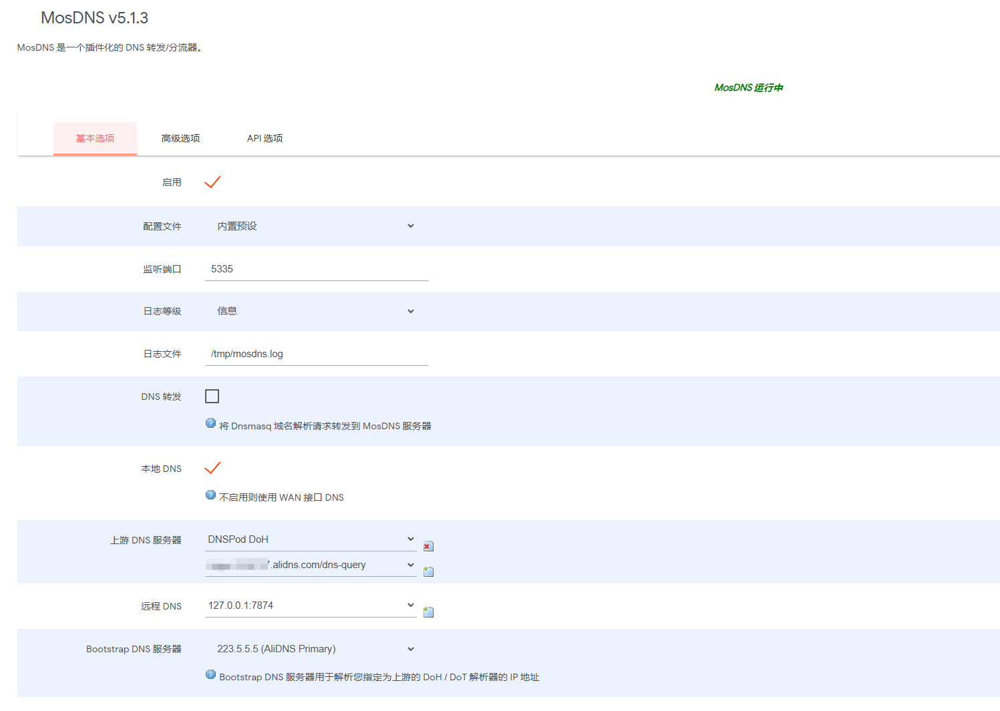
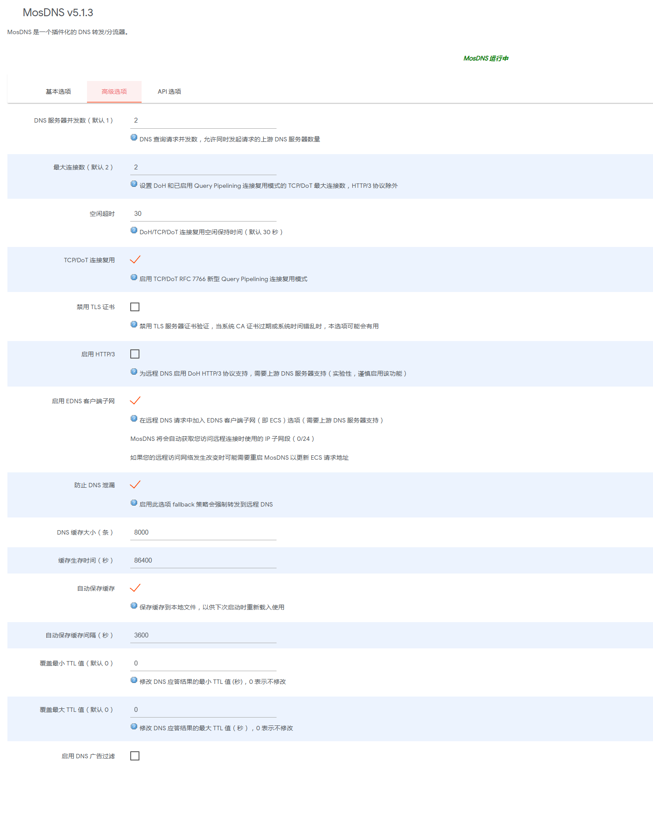
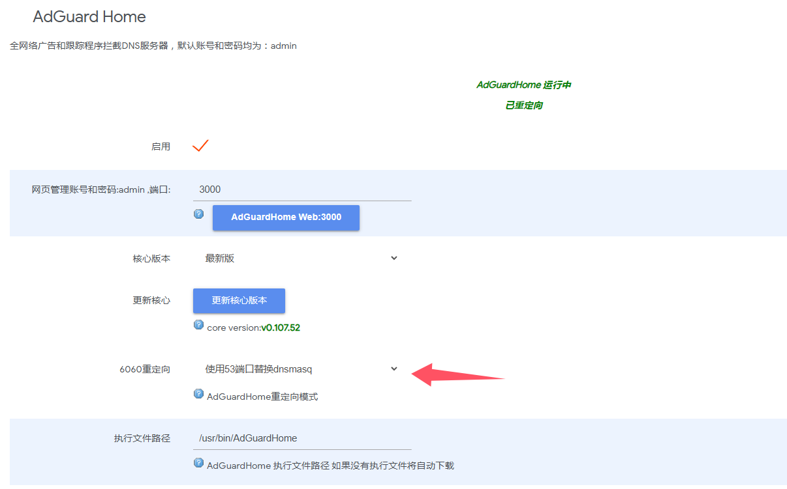
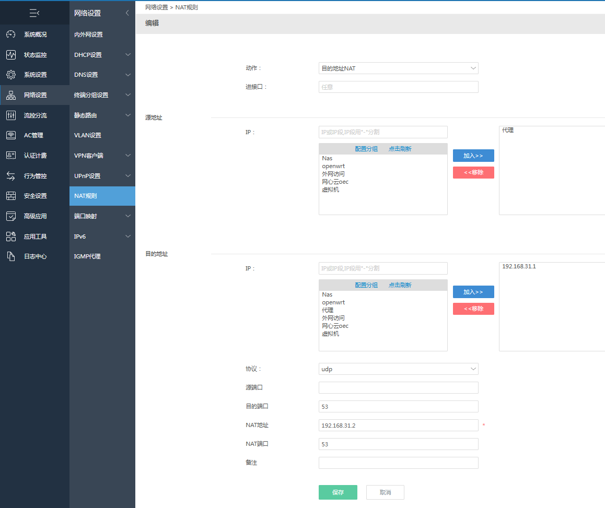
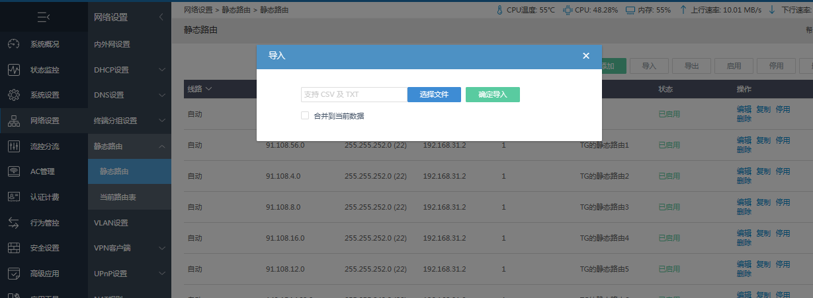
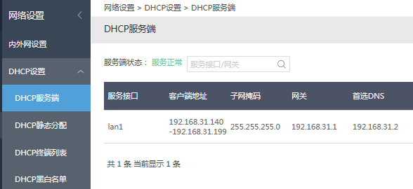
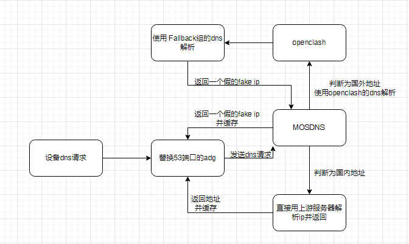

网上关于`mosdns`与`openclash`的教程已经足够多了，但借用fake ip来与ikuai形成有机结合的教程倒是不太多。网上绝大多数人都是将openwrt作为旁路由来使用，需要代理的设备将网关设置到openwrt上来满足xx的需求。但这样就存在一个问题，该设备的所有流量都会经过openwrt来进行一遍分流，如果软路由性能较弱的情况下，势必会对访问国内网站的速度造成一定的影响。那么有没有什么办法可以让国内流量不走openwrt，只有代理的流量走openwrt的方法呢？

借助fake-ip的特点，我们可以通过ikuai的nat转发来解决上面的问题。即便是将网关设置到主路由上，依旧可以通过dns的方式来使国外流量走旁路由，并且配置方法也很简单，不需要繁琐的双网关互指。

# Openwrt的配置

## MosDNS的配置

<div align=center></div>

上游DNS服务器可以填写国内的几个常用DNS例如（不用填的太多2-3个即可）：

```
223.5.5.5
114.114.114.114
https://doh.pub/dns-query
https://dns.alidns.com/dns-query
```

远程DNS为openclash的DNS监听端口，如果没有对其修改的话，默认填写`127.0.0.1:7874`即可

> ※如果不需要使用`AdGuard Home`，这里要将`DNS`转发打开，将访问openwrt的dns请求都转发到mosdns上

<div align=center></div>


## OpenClash的配置

插件设置 - 模式设置 - 运行模式： 切换到 Fake-IP （增强）模式

插件设置 - DNS 设置 - 本地 DNS 劫持 选择 禁用

插件设置 - DNS 设置 - 禁止 Dnsmasq 缓存 DNS 选择 启用

插件设置 - 流量控制 - 绕过中国大陆 IP 取消勾选

插件设置 - 流量控制 - 仅允许内网 开启

插件设置 - IPv6 设置 这页的选项全都关闭就行了

覆写设置 - 常规设置 这里都不用改，只需要确认DNS 监听端口为`7874`

覆写设置 - DNS 设置 - 自定义上游 DNS 服务器 勾选

覆写设置 - DNS 设置 - Fake-IP 地址范围 选择`198.18.0.1/16`

覆写设置 - DNS 设置 - 追加默认 DNS 勾选

覆写设置 - DNS 设置 - Fake-IP 持久化 勾选

覆写设置 - DNS 设置 - Fallback-Filter 勾选，并将这些的内容填写进去[Fallback-Filter.txt](https://github.com/Putarku/clashmeta/blob/main/rule/Fallback-Filter.txt)

覆写设置 - DNS 设置 页面下方 NameServer ，FallBack ，Default-NameServer可以参考下面填写

NameServer

```
取消勾选
```

FallBack

```
tls://1.1.1.1:853
tls://8.8.4.4:853
https://dns.cloudflare.com/dns-query
https://dns.google/dns-query
```

Default-NameServer

```
223.5.5.5
```

## AdGuard Home的配置

主界面 - 重定向 - 替换53端口




设置 - DNS设置 - 上游服务器配置为`127.0.0.1:5335`

设置 - DNS设置 - DNS缓存配置 全部清空，并且关闭乐观缓存

过滤器 - DNS黑名单 添加几条常用的过滤规则即可。

> ※如果不需要使用`AdGuard Home`，请打开mosdns的`DNS`转发，并检查openwrt的`DHCP/DNS - DNS转发`是否为`127.0.0.1:5335`

# ikuai的配置

`网络设置 - NAT规则` ，添加下面这条规则，其中`192.168.31.1`为ikuai的地址，`192.168.31.2`为openwrt的地址，根据自己的网络情况改动。源地址为你想要走代理的设备ip，可以通过`终端分组`设置一个ip段。

这条规则的效果是将局域网内设备访问网关的dns请求都转发到openwrt上，从而进行分流操作。

<div align=center></div>


<br>

<br>

`网络设置 - 静态路由 - 静态路由`，将这个[static_route.txt](https://github.com/Putarku/clashmeta/blob/main/rule/static_route.txt)文件中的`192.168.31.2`修改为你的`openwrt`地址后，再进行导入。这一步非常关键，关系到客户端获取的fake-ip能否转发给openwrt。这个文件中的其他规则是为了某些使用ip进行连接的应用走旁路由而设置的。

<div align=center></div>


<br>

<br>

网络设置-DHCP服务端，将首选、备选DNS改为openwrt的ip，网关设置为主路由ikuai。

<div align=center></div>

<br>


此时重新通过DHCP获取网络配置的设备应该都可以正常连接网络了。


### Openwrt中DNS的处理路径

<div align=center></div>

设备的dns请求被发送到`openwrt`后，会先由`AdGuard Home`进行处理，在没有找到缓存信息的情况下，`AdGuard Home`会对上游的`mosdns`发起dns查询请求。mosdns会先对域名进行判断，如果为国内ip或域名，则直接向上游dns服务器发起查询，并将真实ip返回给`AdGuard Home`，`AdGuard Home`再将ip返回给客户端，客户端通过真实ip可以直接从ikuai的网关出去。

而当时国外的域名时，`mosdns`会交由远程dns也就是`openclash`进行解析，`openclash`在判断为国外ip后会及时返回一个假的fake-ip给mosdns，最后设备会获取到一个假的ip。设备访问这个ip时，会由ikuai的静态路由转发到`openwrt`的`openclash`上，从而走代理进行访问。